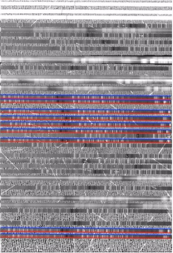

# Overview of SAMOS Pipeline

**This is the master branch, which does not presently include cosmic ray cleaning.  Please see the branch Cosmic\_ray_dev.**

## Getting started
The working directory should begin having the following files and directory:

* `Slit_id.py`

* `OutlineSlits`

* `NormDivFlats`

* `FlatNorm.py`

* `Overscan.py`

* `OverscanAndTrim`

* `SAMOSHelpers.py`

* `WhichFITSFiles`

* `cleaner.sh`

* pdf of Python Data Reduction Procedures

* LDSS3-directory containing test data

Right now, there are 3 main programs that the user runs to reduce data.  `WhichFITSFiles`, `OverscanAndTrim`, and `NormDivFlats`.

This document reviews the purpose and describes how to use these programs to reduce the test data from LDSS3.

## `WhichFITSFiles`

This program retrieves the headers from the sample data in `LDSS3/2017-11-30/` and separates them into a directory corresponding to one two masks **LMask1** and **LMask2**, that the user decides.  It also reads the header keys to determine whether the file contains flat data, comparison lamp data, or science data, and stores it in database files named for their corresponding LMask.

To run this code, it takes two arguments, the name of the directory with the test data (date on which data was retrieved) and the mask for which the user wants to use.  Running this code for LMask1 data would look like:

> ` ./WhichFITSFiles` 2017-11-30 LMask1

After running and reading over the terminal output, you should have a new directory named `LMask1` and a new file named `LMask1.db`.  This step also now keeps track of the field image.  The FITS headers for the test LDSS3 data do not contain the slit positions, so having the image of the actual slit mask is necessary at this time.

## `OverscanAndTrim`

Next, we have to determine the overscan and trim the edges of the fits data. This code reads the database file and creates arrays which separate the data into flats, comparison lamps, and science data.

The main part of `OverscanAndTrim` is the calling of the module `Overscan.py`.  This module parses the fits data array into regions of bias and target data by reading the fits headers ` ''BIASSEC'' ` and ` ''DATASEC'' ` respectively.  There is a function in `Overscan.py` called `FieldTrim(input,output)` that trims the field mask to the correct size.  Then I looked in DS9 for the top edges of each of the slits and made a text file of the positions.  The text file is used in the step `OutlineSlits`.  So far, this is only implemented for LMask2.  The function responsible for trimming and bias subtraction of the other FITS files is `Overscan(input,output)`.

The bias is due to a combination of the camera noise from the readout process and electric ''pre-charge'' on a CCD chip by the electronics.  The ` ''BIASSEC'' ` header gives the region of overscan, which contains information for this bias.  An array of this overscan region is made by grabbing the rows and columns from the data array (`d = f[0].data.astype("f")` &rarr; `overscan = d[biassec rows, biassec columns]`). The function then takes the median (or mean) of the overscan regions along the rows (axis=1), and subtracts these median values from each data value in their respective data rows.  The main procedure is shown in the figure below.

$$
 \begin{pmatrix}
  cropped & and\\\
  bias & subtraced\\\
  data & matrix
 \end{pmatrix} =
 \begin{pmatrix}
 d11 & d12 & d13 & ... & d1m\\\
 d21 & d22 & ... & ... & d2m\\\
 ... & ... & ... & ... & ...\\\
 dn1 & ... & ... & ... & dnm
 \end{pmatrix} -
 \begin{pmatrix}
  [b1]\\\
  [b2]\\\
  [b3]\\\
  [...]\\\
  [bn]
 \end{pmatrix}
$$

With the new data matrix, the function makes a new fits file for the files originally entered as input.  The output fits are placed in their respective LMask directories and 'ccd' part of their original file names are replaced with LMask(1,2).

To call this code, type

> `./OverscanAndtrim` LMask(1,2).db

## `NormDivFlats`

Once we have our cropped and bias subtracted fits files, we need to locate and combine the flat frames into one master flat, which will be divided from the science frames.
First we make a stack of the flat field frames and scale them by their median.  then the stack is median combined and normalized, which gives the pixel-to-pixel variation in detector sensitivity.
The function outputs a fits file named LMask(1,2)master_flat.  Finally, the science frames are divided by the master flat and written out to new frames, which are placed in a directory named  **`flat_fielded`**.

To call this routine, use
> `./NormDivFlats` LMask(1,2).db

The function also creates thumbnail images of the output data frames.

## `OutlineSlits`

Since the headers for the test data do not contain slit information, I typed up a text file of slit positions called `LMask2_ycoords_c1.txt`.  This file contains the top edge pixel for each of the slits in the field image.  (`LMask1_ycoords_c1.txt` is not ready yet.)  The module `Slit_id.py` contains the function `get_edges()`, which is responsible for tracing the slits, using the master flat output from `NormDivFlats` as a template.  `get_edges` takes the master flat and the slit positions text file as input.  The function steps along cutouts of the FITS data frame based on the y-axis positions given in the text.  For each step, the median of the cutout along the x-axis is taken, and then the derivative along the y-axis is computed to locate the transition from the chip to the slid edge.  This steps along the slit until it reaches the end, storing the x and y positions.  The arrays of slit positions are written to a region file called `reg_txt.reg` within the corresponding mask directory (`LMask2` only, for now), and can be loaded into DS9.  An example of this is shown in figure 1.  The slits outlined here are representative of the slits found in the image of the mask field, so not all of the slits in a science image will be included in this step.

<figure>
  

    
    <figcaption><b>Figure 1</b> <code>reg_txt.reg</code> output loaded onto <code>fnLMask28157c1.fits</code> in DS9.</figcaption>
  

<figure>

To run this step, use

> `./OutlineSlits` LMask(1,2).db
